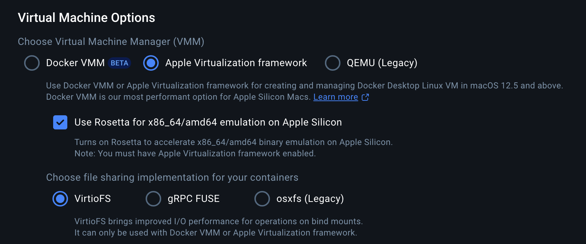
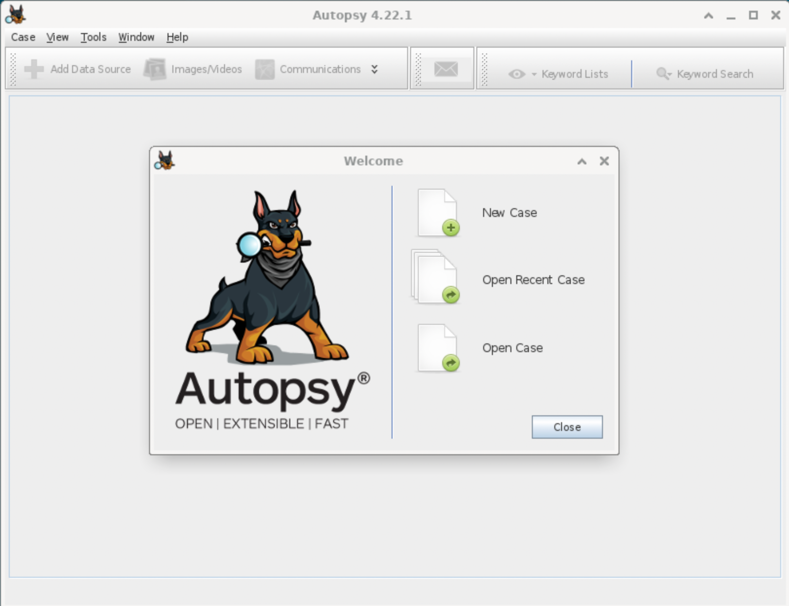

# autopsy-silicon-mac
provides a docker AMD64 image with [autopsy](https://www.autopsy.com) version 4

## Purpose
run autopsy on silicon mac via rosetta for performance

though this should run fine on any AMD64 system

## Getting Started
Assuming apple silicon

1. Install Rosetta 2

`softwareupdate --install-rosetta`

2. Install [Docker Desktop](https://docs.docker.com/get-started/introduction/get-docker-desktop/)

3. Configure Docker Desktop

go to Setting->General->Virtual Machine Options

scroll down

enable 
* Apple Virtualization
* Rosetta
* VirtioFS

should look like this on Docker Desktop 4.4



4. Test Rosetta / Apple Virtualization for AMD64

`docker run -it --entrypoint /bin/sh --rm --platform linux/amd64 alpine`
should provide a root shell.  If no errors then success.  exit.

5. Update docker-compose.yml 
Set bind mount absolute path on host system for file sharing

Services -> Container -> Volumes 

```
 - type: bind
        source: /replace/with/your/path 
```

Modify resolution if desired

Services -> Container -> Environment

`- VNC_RESOLUTION=1920x1080`

6. Start Container

In this project run

`docker-compose up -d`

7. Connect to VNC
Either a VNC client or Web browser will work.

* VNC Client vnc://localhost:35901
* Browser   http://localhost:36901

user: headless
password: headless

VNC capability provided by the excellent [accetto](https://hub.docker.com/r/accetto/ubuntu-vnc-xfce-firefox-g3) project
The VNC documentation from that project applies to this one.  

8. Run autopsy

open a terminal in the vnc client and run

`autopsy`



## Limitations

This is a single user system. Autopsy 4 supports multi-user.

## References

* [docker-desktop-vnc](https://hub.docker.com/r/elestio/docker-desktop-vnc)
* [autopsy](https://www.autopsy.com)
